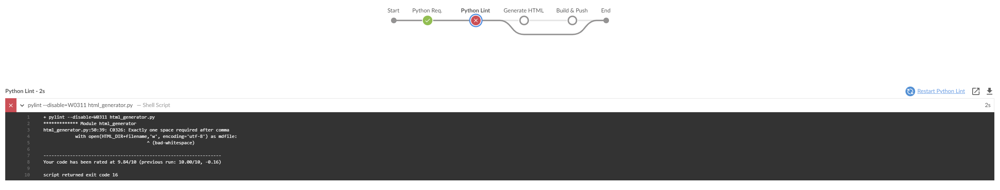
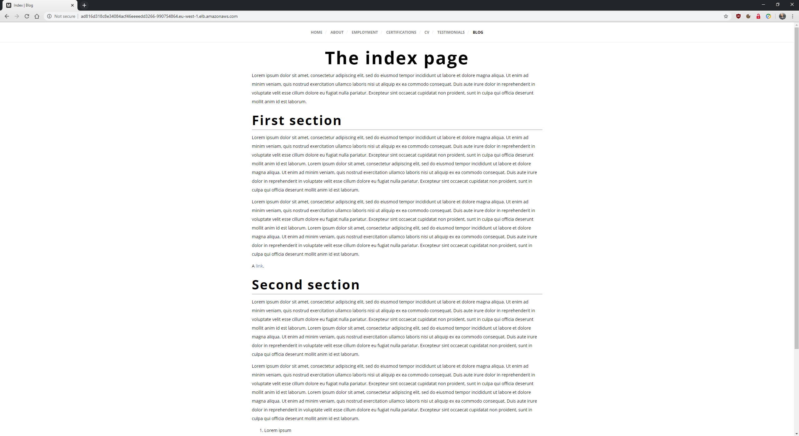

# Cloud DevOps Engineer Capstone Project

 Final project of the DevOps Udacity Nanodegree

## Introduction

In this project I will apply the skills and knowledge which were developed throughout the Cloud DevOps Nanodegree program. These include:

- Working in AWS
- Using Jenkins to implement Continuous Integration and Continuous Deployment
- Building pipelines
- Working with Ansible and CloudFormation to deploy clusters
- Building Kubernetes clusters
- Building Docker containers in pipelines

## Application

The application is my own Python script that generates HTML pages from Markdown files using a template. I use it to generate the blog posts on <https://blog.miguelangelnieto.net>. In this project there is one single page, named `index.md` that will be used as an example:

```
python3 html_generator.py 
```

By default it will convert all Markdown files to HTML.

## Jenkins Pipeline

To automate the publishing of the blog posts I have created a CI/CD pipeline with rolling deployment. The pipeline has these steps:


1. Python Req.

The script's Python requirements are installed. They include `markdown`, `pylint` and `beautifulsoup4`.

2. Python Lint**

Check the script's code with pylint. This is the output when the steps fails:



3. Generage HTML

The HTML pages are generated.

4. Build & Push

The docker image is build using the Dockerfile and the image is pushed to Amazon Elastic Container Registry.

## Kubernetes Cluster

Cloudformation is used to deploy the Kubernetes Cluster and the NodeGroup. The code is in `cloudformation` directory. It is divided in two stacks, one for the network (network.yaml) and a second one for the cluster itself (EKS.yaml).

There are two scripts to create and update the stacks. For example, to create both stacks:

```
./stack-create.sh capstone-stack network.yaml network-parameters.json
./stack-create.sh capstone-eks EKS.yaml EKS-parameters.json
```
This will create the stack in the following order:

1. VPC in eu-west-1.
2. Internet Gateway attached to the VPC.
3. Two public subnets in different AZs.
4. Public route table associated with the two public subnets.
5. Security group for the cluster.
6. Kubernetes cluster.
7. Kubernetes node group.

## Commands to create the Kubernetes deployment

Once the Jenkins pipeline has finished and the cluster is deployed, we can create the Kubernetes deployment. The files are located in `kubernetes` directory. To deploy them:

1. Create a  `kubectl` configuration:

```
$ aws eks --region eu-west-1 update-kubeconfig --name capstone-project
```

1. Create the Web Servers deployment:

```
$ kubectl apply -f deployment.yml
```

2. Check the pod has been created:

```
$ kubectl get pods
NAME                         READY   STATUS    RESTARTS   AGE
webserver-7f775f67cc-l87ff   1/1     Running   0          3m34s
```

3. Create the loadbalancer service:

```
$ kubectl apply -f loadbalancer.yml
```

4. Get the loadbalancer public DNS record:

```
kubectl get service/loadbalancer
NAME           TYPE           CLUSTER-IP       EXTERNAL-IP                                                              PORT(S)        AGE
loadbalancer   LoadBalancer   172.20.100.179   ad816d318c8e34084acf46eeeedd3266-990754864.eu-west-1.elb.amazonaws.com   80:30308/TCP   58s
```

## View the public web page

Finally, enter the public DNS record in the web browser to access the page:

