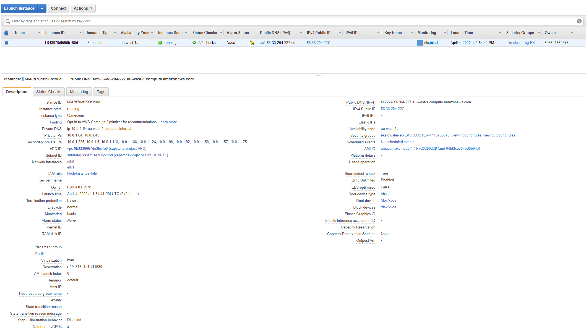
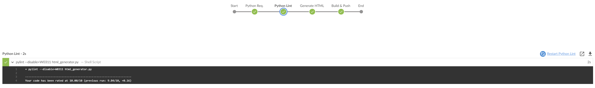

# Cloud DevOps Engineer Capstone Project

 Final project of the DevOps Udacity Nanodegree

## Introduction

In this project I will apply the skills and knowledge which were developed throughout the Cloud DevOps Nanodegree program. These include:

- Working in AWS
- Using Jenkins to implement Continuous Integration and Continuous Deployment
- Building pipelines
- Working with Ansible and CloudFormation to deploy clusters
- Building Kubernetes clusters
- Building Docker containers in pipelines

## Application

The application is my own Python script that generates HTML pages from Markdown files using a template. I use it to generate the blog posts on <https://blog.miguelangelnieto.net>. In this project there is one single page, named `index.md` that will be used as an example:

```
python3 html_generator.py 
```

By default it will convert all Markdown files to HTML.

## Kubernetes Cluster

Cloudformation is used to deploy the Kubernetes Cluster and the NodeGroup. The code is in `cloudformation` directory. It is divided in two stacks, one for the network (network.yml) and a second one for the cluster itself (EKS.yml).

There are two scripts to create and update the stacks. For example, to create both stacks:

```
./stack-create.sh capstone-stack network.yml network-parameters.json
./stack-create.sh capstone-eks EKS.yml EKS-parameters.json
```
This will create the stack in the following order:

1. VPC in eu-west-1.
2. Internet Gateway attached to the VPC.
3. Two public subnets in different AZs.
4. Public route table associated with the two public subnets.
5. Security group for the cluster.
6. Kubernetes cluster.
7. Kubernetes node group.

The node group is created in EC2:



## Jenkins Pipeline

I am using a CI/CD pipeline on a rolling deployment. On each new HTML generated, the docker image is updated, pushed to AWS and the Kubernetes nodes are rolled out so they restart with the new image from the repository. There is a load balancer before the exposed 80 TCP ports to avoid having downtime.

The pipeline has these steps:


1. Python Req.

The script's Python requirements are installed. They include `markdown`, `pylint` and `beautifulsoup4`.

```
pip3 install -r requirements.txt
```

2. Python Lint

Check the script's code with pylint. 

```
pylint --disable=W0311 html_generator.py
```

This is the output when the steps fails:


And this is the output when it passes:



3. Generage HTML

The HTML pages are generated.

```
python3 html_generator.py
```

4. Build & Push

The docker image is build using the Dockerfile and the image is pushed to Amazon Elastic Container Registry.

```
aws ecr get-login-password --region eu-west-1 | docker login --username AWS --password-stdin 628641662978.dkr.ecr.eu-west-1.amazonaws.com/capstone
docker -H=tcp://localhost:2375 build -t capstone .
docker -H=tcp://localhost:2375 tag capstone:latest 628641662978.dkr.ecr.eu-west-1.amazonaws.com/capstone:latest
docker -H=tcp://localhost:2375 push 628641662978.dkr.ecr.eu-west-1.amazonaws.com/capstone:latest
```

5. Docker Container

A Docker Container is started to test if there is any problem using the image.

```
docker -H=tcp://localhost:2375 container run 628641662978.dkr.ecr.eu-west-1.amazonaws.com/capstone:latest
```

6. Deployment

The Kubernetes pods are deployed using the pushed image. This is a no-op if the deployment files have not changed.

```
kubectl apply -f deployment.yml
kubectl apply -f loadbalancer.yml
```

7. Rollout Deployment

Rollout the pods to use the new pushed image.

```
kubectl rollout restart deployment/webserver
```

## View the public web page

Finally, enter the public DNS record in the web browser to access the page.


